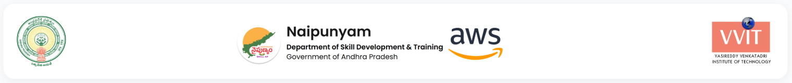
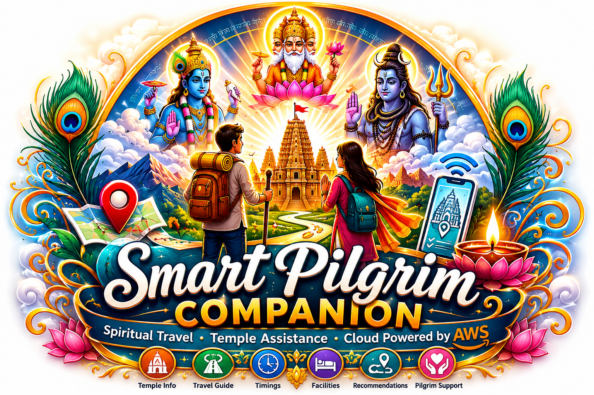

  

  

# Smart Pilgrim Companion: Cloud-Based Spiritual Travel & Temple Assistance Platform Using AWS

---

## Team Members

| S. No. | Roll Number | Team Member Name | Gender |
|:-----:|:-----------:|------------------|:------:|
| 1 | 23BQ1A4201 | ADHIMULAM BHARGAV SAI VISWANATH | M |
| 2 | 23BQ1A4218 | BEZAWADA MEGHANA | F |
| 3 | 23BQ1A4222 | BODEPUDI NAGA SOUMYA | F |
| 4 | 23BQ1A4238 | DERANGULA VISHNUVARDHAN | M |
| 5 | 23BQ1A4269 | JUJJURI LAKSHMI SOWMYA | F |

 

### Batch 1: Serial No: 65

## ☁️ Developed Under

**APSSDC AWS Cloud & DevOps Internship Program**

### 👨‍🏫 Under the Guidance of (APSSDC)

- **Mrs. Bethala Sumana**, APSSDC
- **Mr. Juttuka Lovababu**, APSSDC

---

<!-- College Logo (Centered) -->

  

 

# DEPARTMENT OF COMPUTER SCIENCE & ENGINEERING – ARTIFICIAL INTELLIGENCE & MACHINE LEARNING (CSM)

### VASIREDDY VENKATADRI INSTITUTE OF TECHNOLOGY

*(Approved by AICTE and Permanently Affiliated to JNTUK)*  

**Accredited by NBA and NAAC with 'A' Grade**

📍 Nambur (V), Pedakakani (M), Guntur – 522 508  

**JULY 2026**

---

## 🚀 Featured Repository

➡️ **[Smart Pilgrim Companion](https://github.com/APSSDC-AWS-VVIT/smart-pilgrim-companion)**

Cloud-Based Spiritual Travel & Temple Assistance Platform developed using:

- React + Vite
- Flask + Gunicorn
- AWS EC2
- AWS RDS MySQL
- AWS S3
- IAM
- CloudWatch
- Nginx Reverse Proxy
